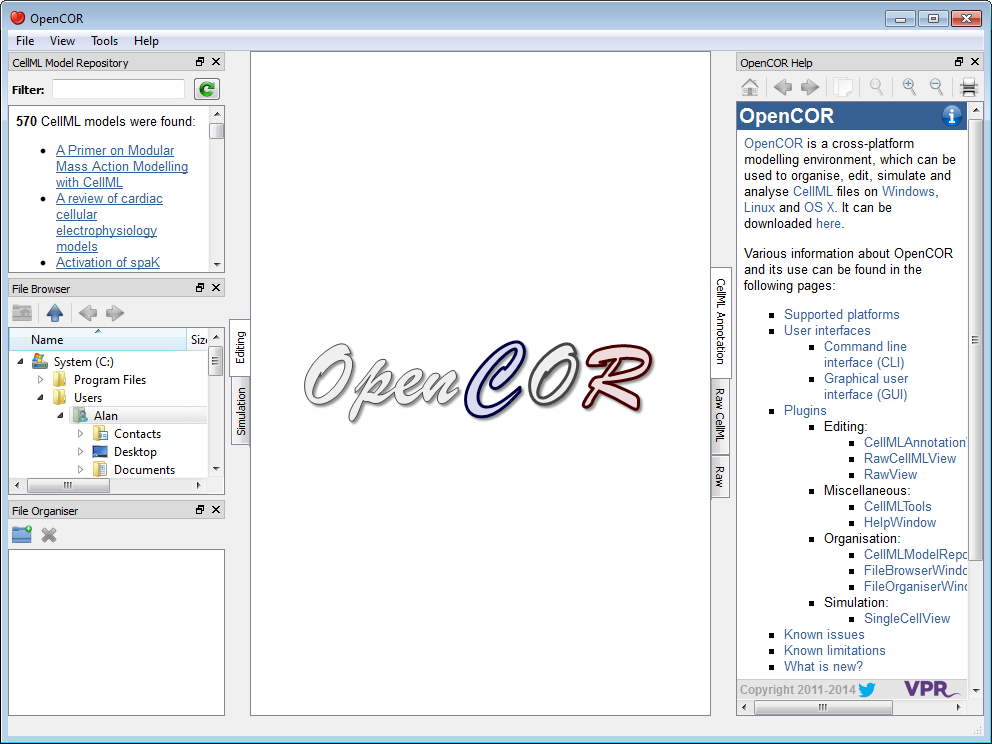
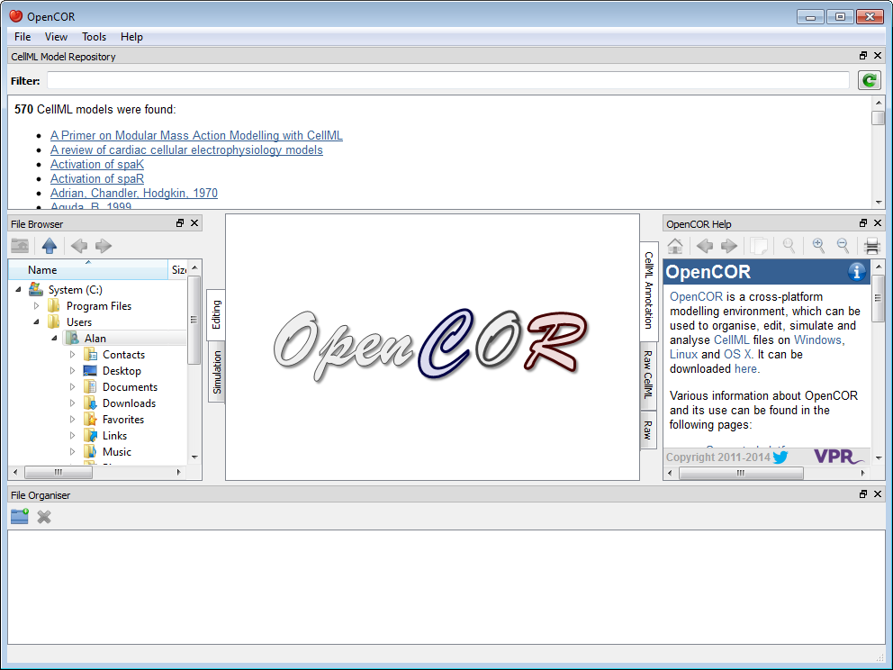
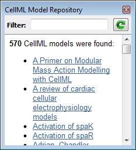
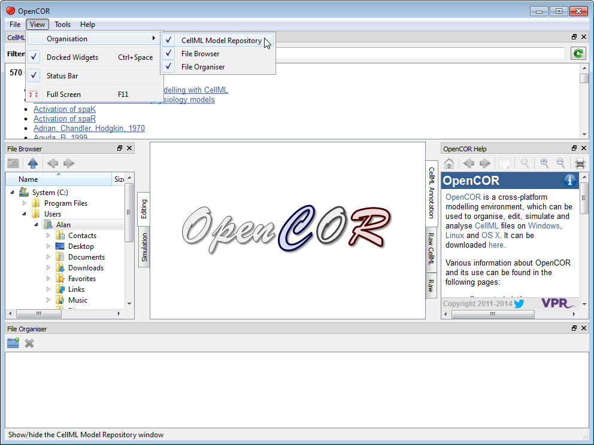
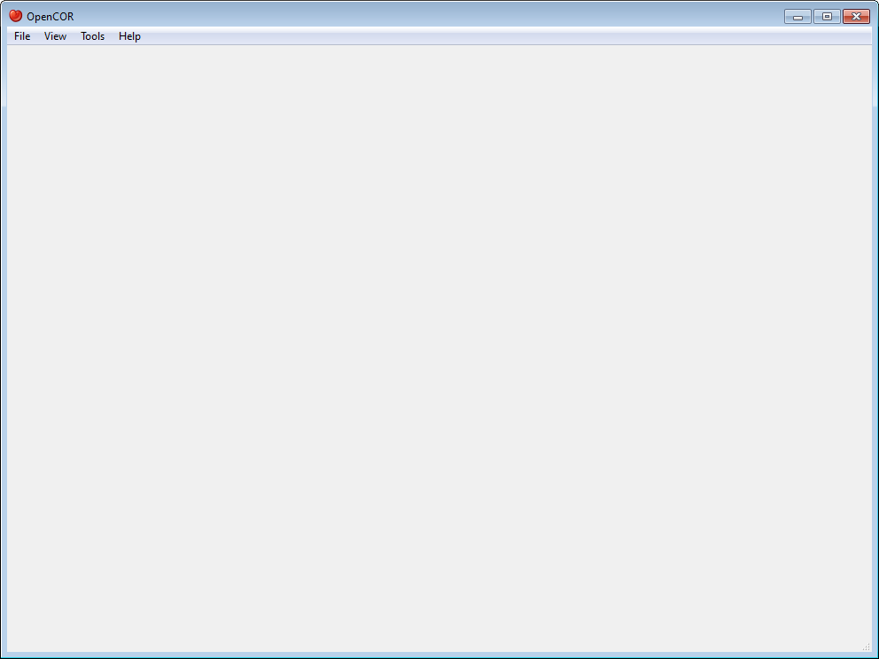

.. _OpenCOR-gui:

==============================
Graphical User Interface (GUI)
==============================

OpenCOR offers a consistent GUI across the :ref:`different platforms <OpenCOR-supportedplatforms>` it supports. The look and feel of the interface is determined by the :ref:`plugins <OpenCOR-pluginapproach>` which are selected. The first time you run OpenCOR, it will look something like this:

The central area is used to interact with files. By default, no files are open, hence the OpenCOR logo is shown instead. To the sides, there are dockable windows, which provide additional features. Those windows can be dragged and dropped to the top or bottom of the central area:

Alternatively, they can be undocked:

Or even closed, either by directly closing the window itself or by unticking the corresponding menu item (under the :guilabel:`View` menu, or the :guilabel:`Help` menu for the Help window):

To unselect all the :ref:`plugins <OpenCOR-pluginapproach>` will result in OpenCOR looking 'empty':

Menu
----

* **File:**
    * **Exit ~ Alt+F4:** exit OpenCOR.
* **View:**
    * **Status Bar:** show/hide the status bar.
    * **Full Screen ~ F11:** switch to / back from full screen mode.
* **Tools:**
    * **Language:** select the language to be used by OpenCOR.
    * **Plugins...:** un/select plugins.
    * **Reset All:** reset all your settings.
* **Help:**
    * **Home Page:** open the OpenCOR home page.
    * **About...:** some general information about OpenCOR.
