.. _OpenCOR-plugin-cellmlannotationview:

===========================
CellMLAnnotationView Plugin
===========================

The CellMLAnnotationView plugin can be used to annotate CellML files. If you open a CellML file which does not contain any annotation, then it will look something like this:

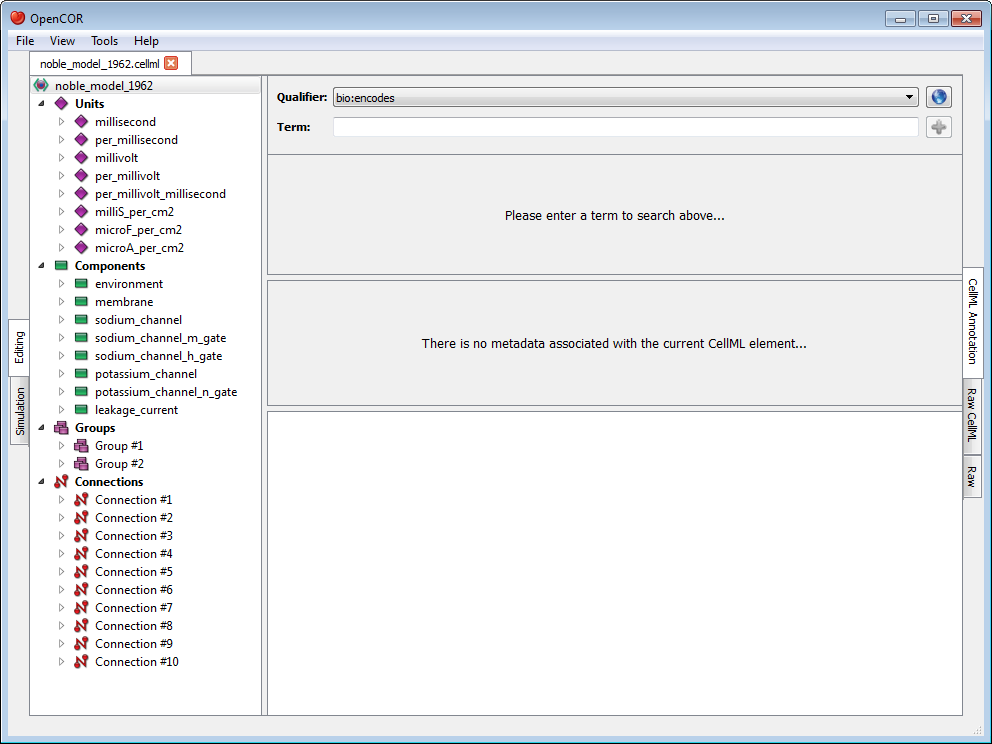

All the CellML elements which can be annotated are listed to the left of the view. If you right click on any of them, you will get a popup menu which you can use to expand/collapse all the child nodes, as well as remove the metadata associated with the current CellML element or the whole CellML file:

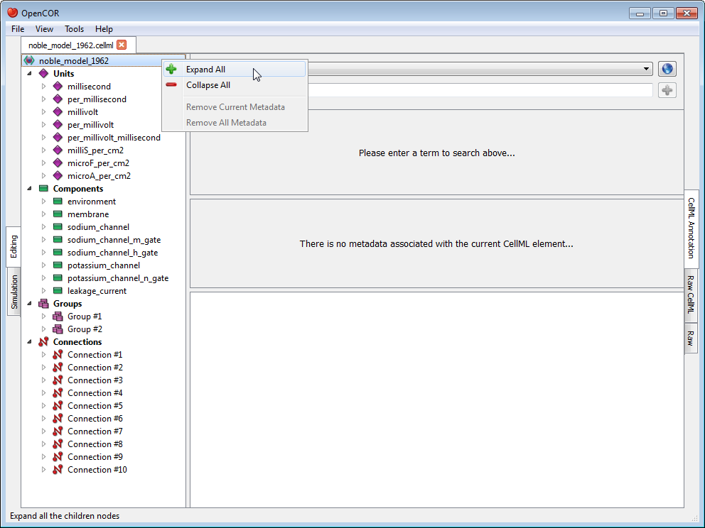

.. _OpenCOR-annotateACellmlElement:

Annotate a CellML element
-------------------------

Say that you want to annotate the ``sodium_channel`` component. First, you need to select it:

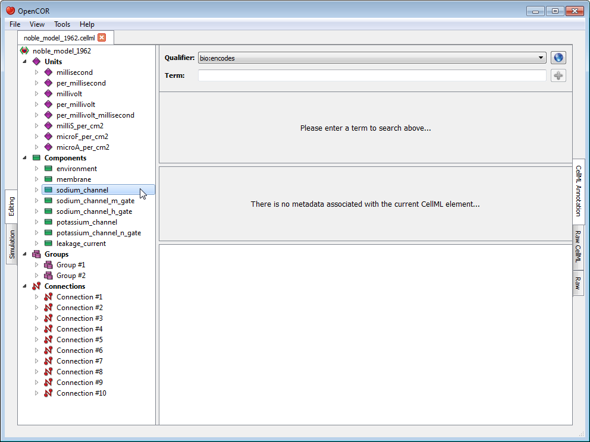

Next, you need to specify a `BioModels.net qualifier <http://biomodels.net/qualifiers/>`_. If you do not know which one to use, click on the |applications-internet| button to get some information about the current BioModels.net qualifier:

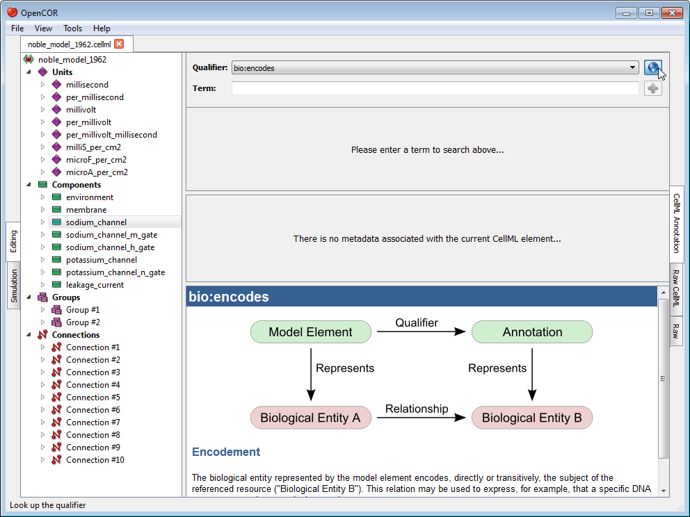

From there, go through the list of BioModels.net qualifiers until you find the one you are happy with. Here, we will use ``bio:isVersionOf``:

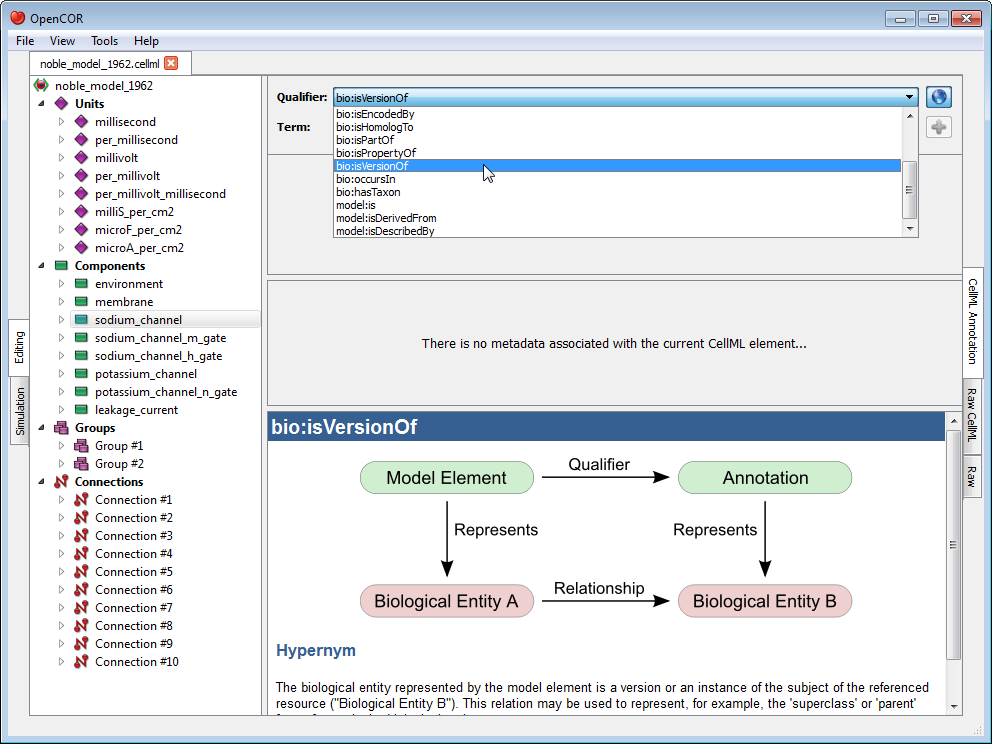

Now, you need to retrieve some possible ontological terms to describe the ``sodium_channel`` component. For this, you must enter a search term which in our case is going to be ``sodium channel`` (note: `regular expressions <http://en.wikipedia.org/wiki/Regular_expression>`_ are supported). As can be seen, OpenCOR returns 12 possible ontological terms:

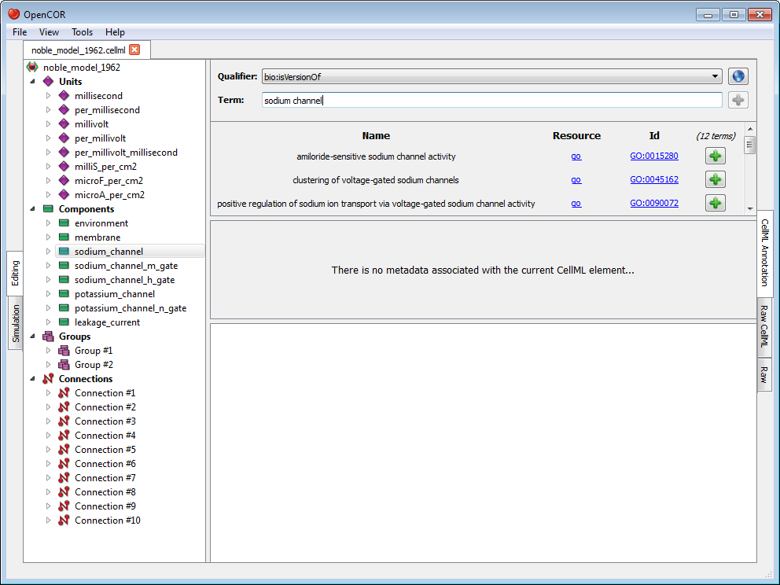

A quick look through the list tells us that you might want to use the one for ``voltage-gated sodium channel complex``. If you want to know more about the GO resource, you can click on its corresponding link:

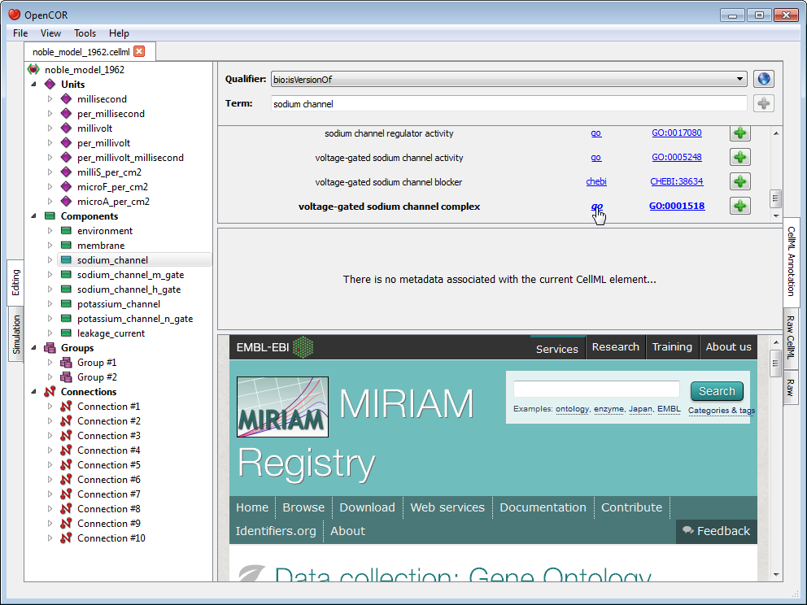

Similarly, if you want to know more about the GO identifier:

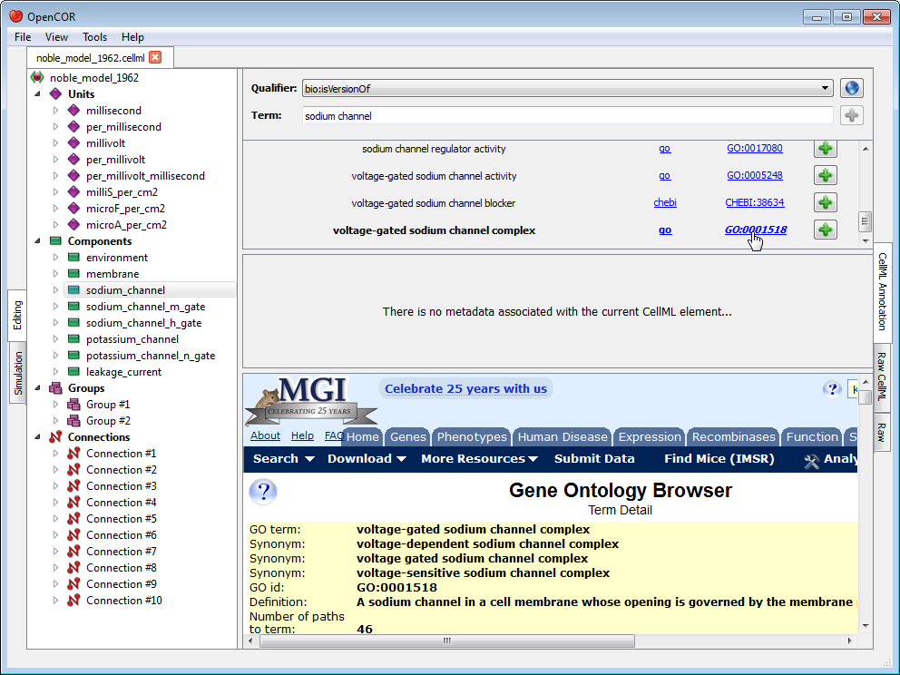

.. |list-add|
    image:: ../resources/images/oxygen/actions/list-add.png
        :width: 1.1em
        :height: 1.1em

Now that you are happy with your choice of ontological term, you can associate it with the ``sodium_channel`` component by clicking on its corresponding |list-add| button:

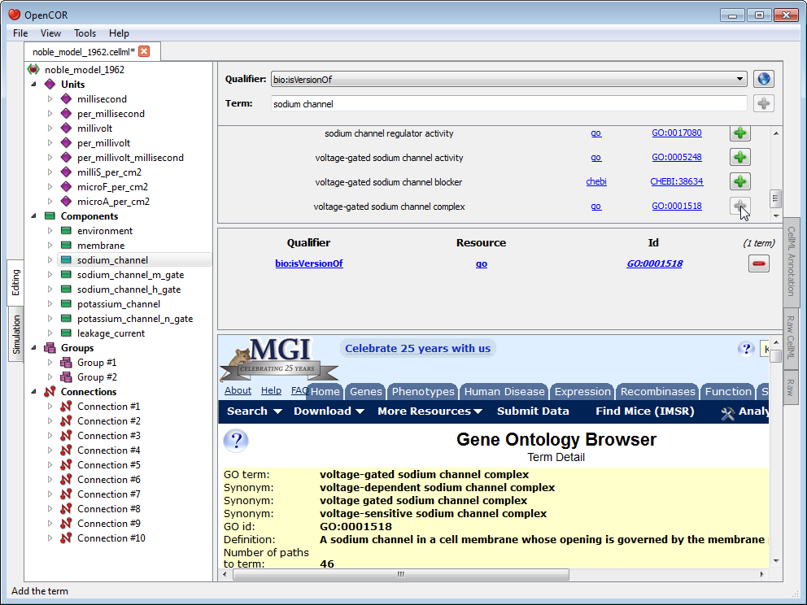

.. |list-remove|
    image:: ../resources/images/oxygen/actions/list-remove.png
        :width: 1.1em
        :height: 1.1em

As you will have seen, the ontological term you have just added cannot be added anymore, but it  can be removed by clicking on its corresponding |list-remove| button or by using the context menu (see above).

Now, say that you also want to add the next ontological term. You can obviously do so by clicking on the corresponding |list-add| button, but you could also enter its resource-id duple, e.g. ``go/GO:0005248`` (i.e. ``<resource>/<id>``) in the term field. Indeed, OpenCOR will recognise this 'term' as being a a resource-id duple and will offer you to add its corresponding ontological term directly:

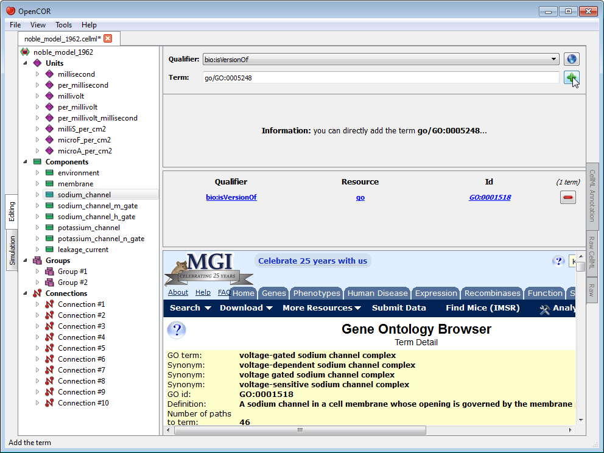

Unrecognised annotations
------------------------

Annotations consist of `RDF triples <http://www.w3.org/TR/rdf-concepts/#section-triples>`_ which are made of a subject, a predicate and an object. OpenCOR recognises RDF triples which subject identifies a CellML element while it expects the predicate to be a `BioModels.net qualifier <http://biomodels.net/qualifiers/>`_ and the object an ontological term.

Ontological terms used to be identified using `MIRIAM <http://www.ebi.ac.uk/miriam/main/mdb?section=use>`_ URNs, but these have now been deprecated in favour of `identifiers.org <http://www.identifiers.org/>`_ URIs. OpenCOR recognises both, but it will only serialise annotations using identifiers.org URIs.

Now, it may happen that a file contains annotations that are not recognised by OpenCOR. In this case, OpenCOR will display the annotations as a simple list of RDF triples:

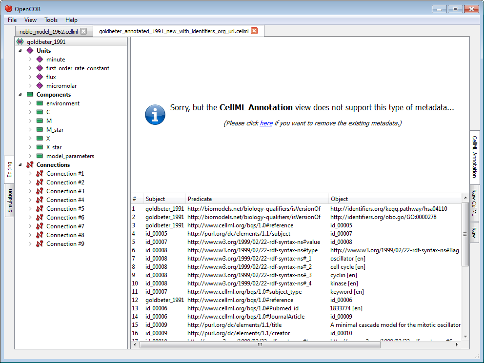

If you ever come across a type of annotations which you think OpenCOR ought to recognise, but does not, then please do `contact us <http://www.opencor.ws/user/contactUs.html>`_.
