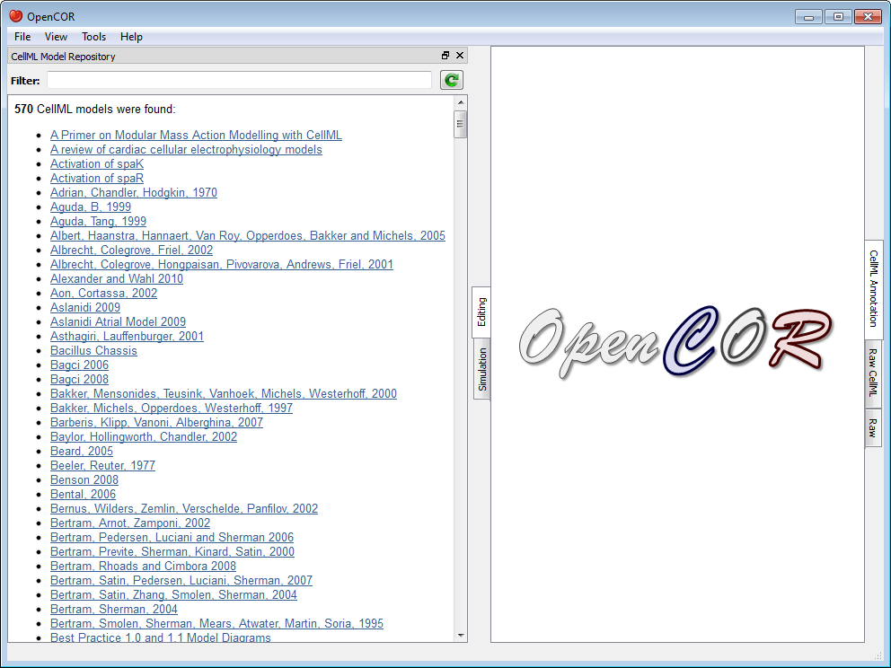
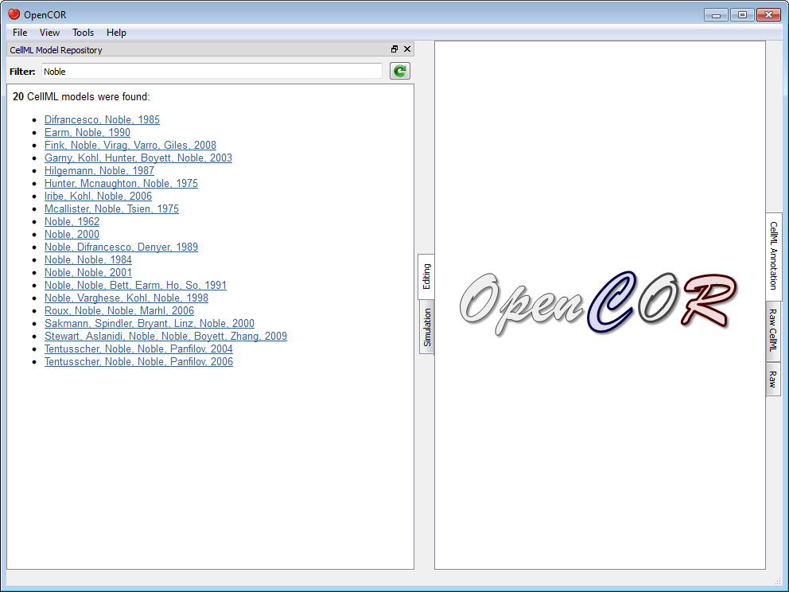

.. _OpenCOR-plugin-cellmlmodelrepositorywindow:

==================================
CellMLModelRepositoryWindow Plugin
==================================

The CellMLModelRepositoryWindow plugin offers an interface to the `CellML Model Repository <http://models.cellml.org>`_. By default, it lists all the CellML models found in the repository:

The list can then be filtered. For example, if you enter ``Noble`` as a filter, you will get:

To click on any of the listed links will open the :term:`workspace` for that model in your (default) web browser. From there, you can retrieve the latest :term:`exposure` for that model.