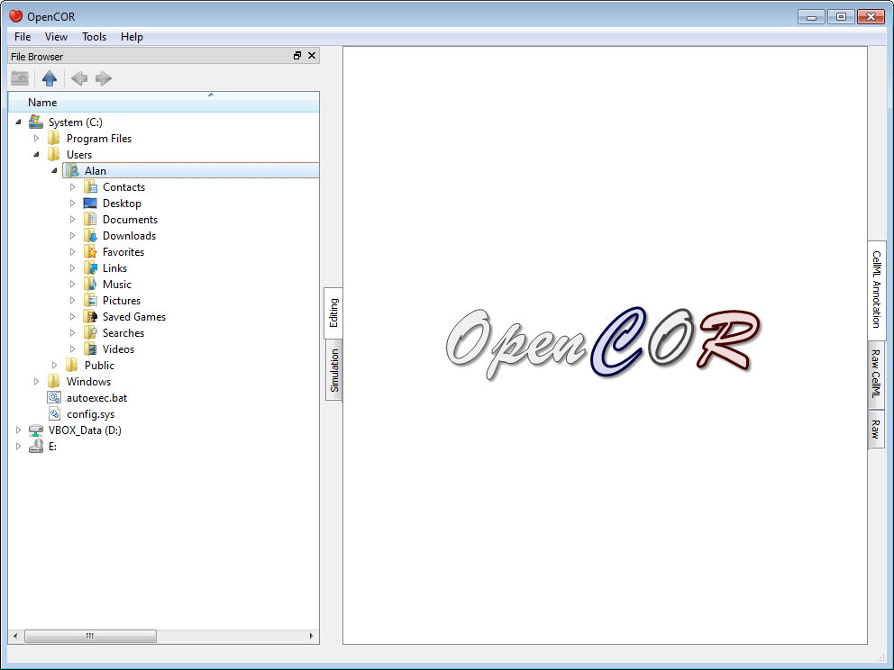
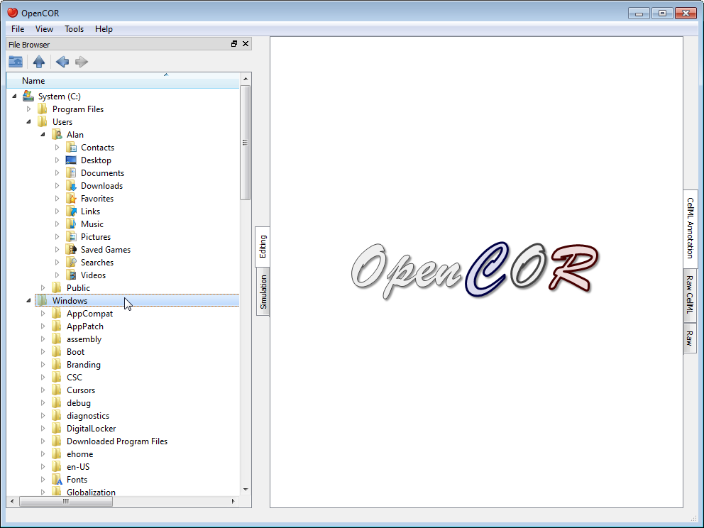
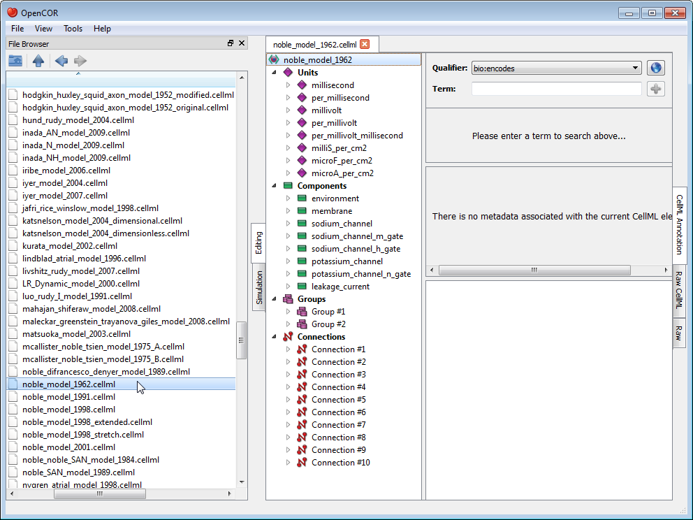

.. _OpenCOR-plugin-filebrowserwindow:

========================
FileBrowserWindow Plugin
========================

The FileBrowserWindow plugin offers a convenient way to access your physical files, remembering the folder or file that was selected when you last ran OpenCOR. By default, it will select your home directory:

As you would expect, to double click on a folder will expand its contents, as can be seen by double clicking on the Windows directory:

On the other hand, to double click on a file will result in it being opened in OpenCOR. The rendering of the file will depend on the current view being selected. In the case of the :ref:`CellML Annotation <OpenCOR-plugin-cellmlannotationview>` view, it will look something like this:

Folders and files can also be dragged from the File Browser window and dropped onto the :ref:`File Organiser <OpenCOR-plugin-fileorganiserwindow>` window.

Tool bar
--------

.. |go-up|
    image:: ../resources/images/oxygen/actions/go-up.png
        :width: 1.3em
        :height: 1.3em

.. |go-previous|
    image:: ../resources/images/oxygen/actions/go-previous.png
        :width: 1.3em
        :height: 1.3em

.. |go-next|
    image:: ../resources/images/oxygen/actions/go-next.png
        :width: 1.3em
        :height: 1.3em

|user-home|  Go to the home folder

|go-up|   Go to the parent folder

|go-previous| Go to the previous folder or file

|go-next|  Go to the next folder or file