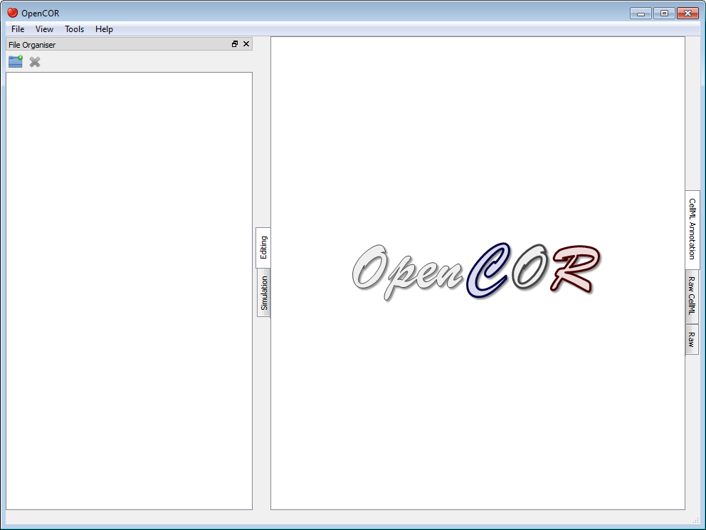
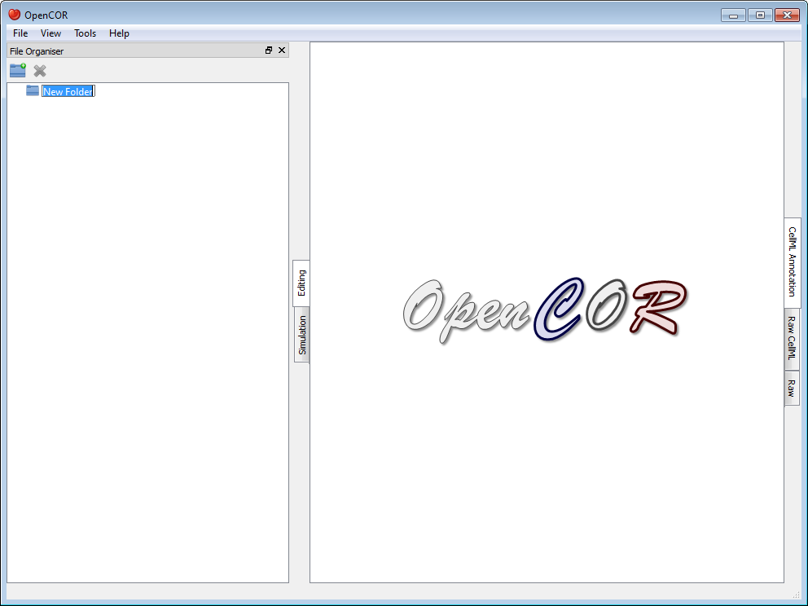
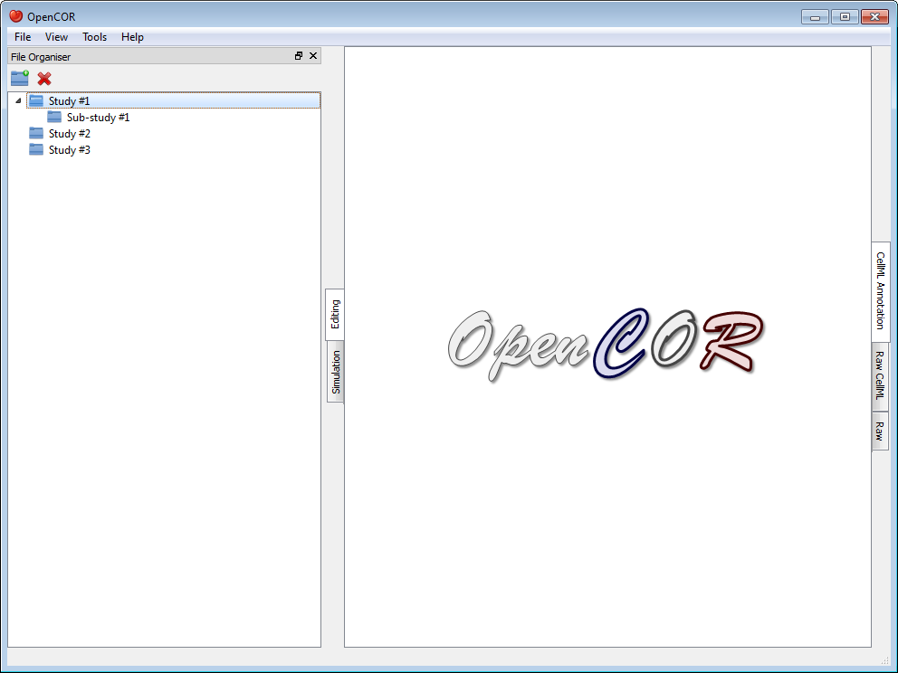
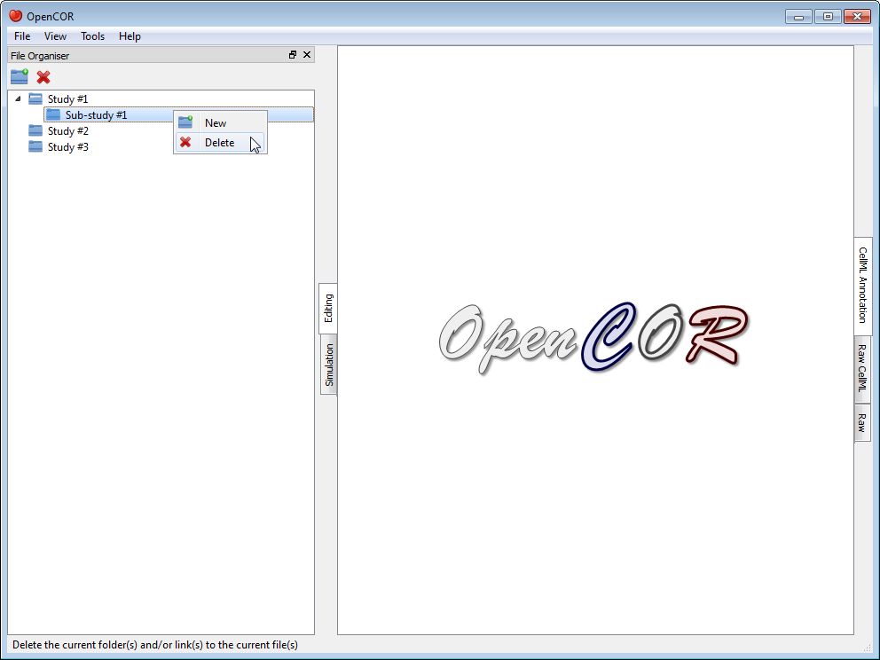
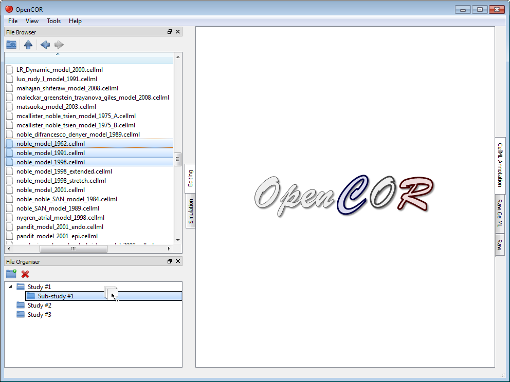
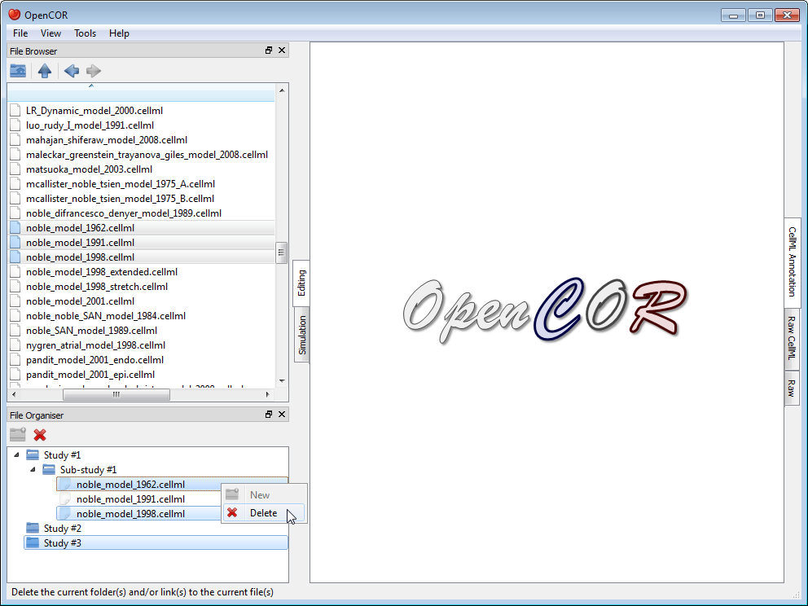

.. _OpenCOR-plugin-fileorganiserwindow:

==========================
FileOrganiserWindow Plugin
==========================

.. |folder-new|
    image:: ../resources/images/oxygen/actions/folder-new.png
        :width: 1.3em
        :height: 1.3em

.. |edit-delete|
    image:: ../resources/images/oxygen/actions/edit-delete.png
        :width: 1.3em
        :height: 1.3em

The FileOrganiserWindow plugin allows you to organise your files in a virtual manner, i.e. independently of where they are physically located. Your virtual environment is remembered from one session to another and is originally empty:

Now, say that you are working on a specific project. You might then want to create a (virtual) folder, which contains (a virtual link to) all the files you need for your project. For this, you first need to click on the |folder-new| button in the toolbar (or use the context menu). This will add a folder to your virtual environment:

You can rename the folder as you wish, as well as create other (sub-)folders, if needed:

You can also move the (sub-)folders around by dragging and dropping them within your virtual environment, or delete an existing (sub-)folder by clicking on the |edit-delete| button in the toolbar (or by using the context menu):

Next, you might want to open the :ref:`File Browser <OpenCOR-plugin-filebrowserwindow>` window, so you can start dragging and dropping files into your virtual environment (alternatively, you can use your system's file manager):

As for folders, you can move and delete your (virtual) files:

Tool bar
--------

|folder-new|   Create a new folder

|edit-delete|   Delete the current folder(s) and/or link(s) to the current file(s)
