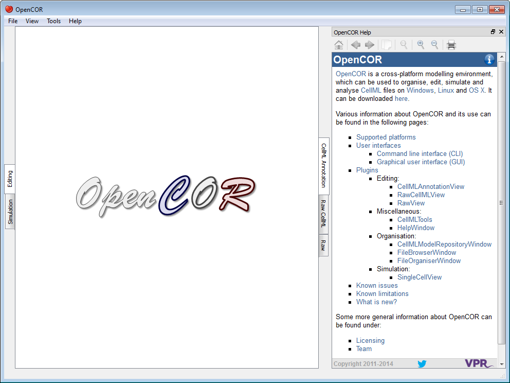
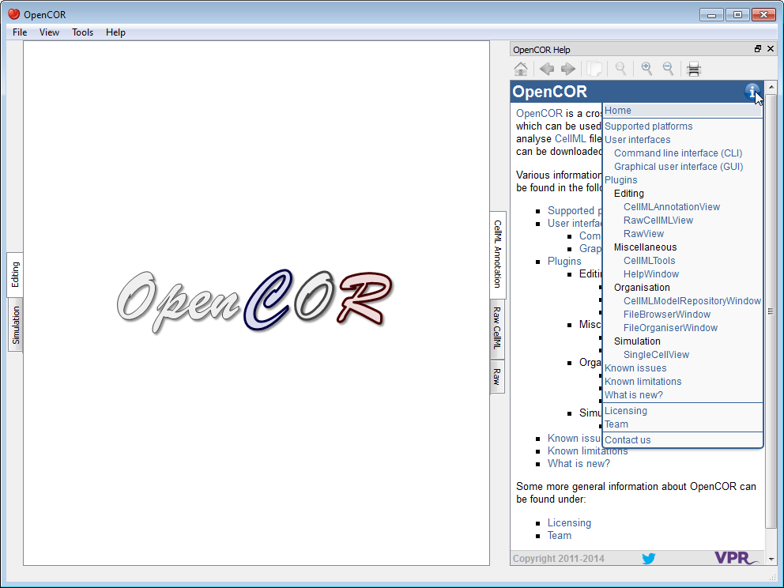

.. _OpenCOR-plugin-helpwindow:

=================
HelpWindow Plugin
=================

The HelpWindow plugin provides some user documentation that looks as follows:

The contents of the documentation is the same as the one that can be found in the `user documentation <http://www.opencor.ws/user/index.html>`_ section of the `OpenCOR website <http://www.opencor.ws/>`_. This includes a menu that gets shown whenever you move your mouse pointer over the information icon (top right):

In addition to what is shown on the website, the HelpWindow plugin also displays special links, which when clicked send a command to OpenCOR. For example, open the current page both in OpenCOR and on the `OpenCOR website <http://www.opencor.ws/user/plugins/miscellaneous/HelpWindow.html>`_. Now, if you check the bold text below, you will see that its contents is slightly different, depending on whether you are reading this in OpenCOR or from the OpenCOR website:

**To open the About box, select the** :menuselection:`Help --> About`\ **... menu...**

Tool bar
--------

.. |go-home|
    image:: ../resources/images/oxygen/actions/go-home.png
        :width: 1.3em
        :height: 1.3em

.. |go-previous|
    image:: ../resources/images/oxygen/actions/go-previous.png
        :width: 1.3em
        :height: 1.3em

.. |go-next|
    image:: ../resources/images/oxygen/actions/go-next.png
        :width: 1.3em
        :height: 1.3em

.. |edit-copy|
    image:: ../resources/images/oxygen/actions/edit-copy.png
        :width: 1.3em
        :height: 1.3em

.. |zoom-original|
    image:: ../resources/images/oxygen/actions/zoom-original.png
        :width: 1.3em
        :height: 1.3em

.. |zoom-in|
    image:: ../resources/images/oxygen/actions/zoom-in.png
        :width: 1.3em
        :height: 1.3em

.. |zoom-out|
    image:: ../resources/images/oxygen/actions/zoom-out.png
        :width: 1.3em
        :height: 1.3em

|go-home|  Go to the home page

|go-previous|  Go back

|go-next|  Go forward

|edit-copy|  Copy the selection to the clipboard

|zoom-original| Reset the size of the help page contents

|zoom-in|  Zoom in the help page contents

|zoom-out| Zoom out the help page contents

|document-print| Print the help page contents