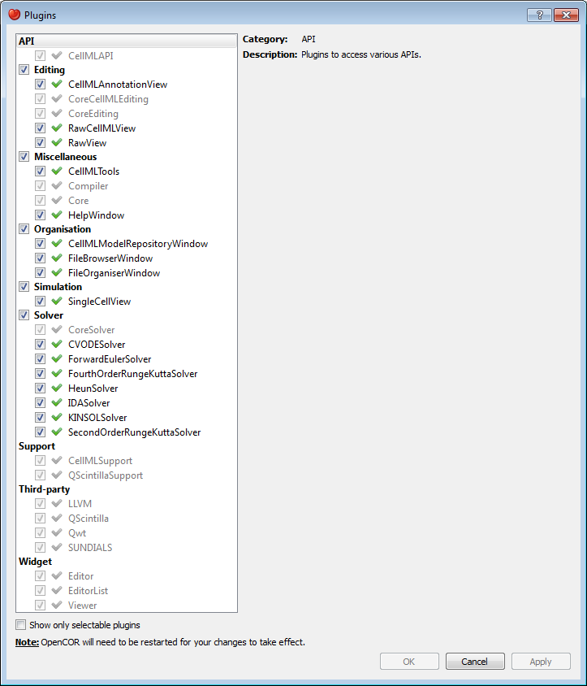

.. _OpenCOR-pluginapproach:

=======
Plugins
=======

OpenCOR is a plugin-based application. This means that if no plugins are selected, then OpenCOR can do :ref:`next to nothing <OpenCOR-gui>`.

As can be seen by opening the Plugins dialog box (by selecting the :menuselection:`Tools --> Plugins` menu) and by unselecting :guilabel:`Show only selectable plugins` (if necessary), OpenCOR supports different types of plugins:

You can select which plugins you want to use. However, plugins which are needed by other plugins (e.g. the Core plugin is needed by the :ref:`CellMLModelRepositoryWindow <OpenCOR-plugin-cellmlmodelrepositorywindow>` plugin) cannot be directly selected. Instead, they will be automatically selected if and only if they are needed by at least one other plugin.

Most of the selectable plugins come with some kind of a :ref:`GUI <OpenCOR-gui>`, which is of one of two types:

* **Window:** such a plugin (e.g. the :ref:`CellMLModelRepositoryWindow <OpenCOR-plugin-cellmlmodelrepositorywindow>` and :ref:`HelpWindow <OpenCOR-plugin-helpwindow>` plugins) can be docked around the central area, undocked or hidden, as illustrated :ref:`here <OpenCOR-gui>`.
* **View:** such a plugin (e.g. the :ref:`CellMLAnnotationView <OpenCOR-plugin-cellmlannotationview>` and :ref:`SingleCellView <OpenCOR-plugin-singlecellview>` plugins) is used to interact with a file, be it to edit it, simulate it or analyse it.

API
===

(Non-selectable) API plugins are used to provide access to various APIs:

* **CellMLAPI:** a plugin to access the `CellML API <http://cellml-api.sourceforge.net/>`_.

Data Store
==========

Data Store plugins are used to store and manipulate simulation data:

* **CSVDataStore:** a `CSV <http://en.wikipedia.org/wiki/Comma-separated_values>`_ specific data store plugin.

There is also one non-selectable Data Store plugin:

* **CoreDataStore:** the core data store plugin.

Editing
=======

Editing plugins are used to edit files:

* :ref:`CellMLAnnotationView <OpenCOR-plugin-cellmlannotationview>`: a plugin to annotate `CellML <http://cellml.org>`_ files.
* :ref:`PrettyCellMLView <OpenCOR-plugin-prettycellmlview>`: a plugin to edit `CellML <http://cellml.org>`_ files using a pretty CellML format.
* :ref:`RawCellMLView <OpenCOR-plugin-rawcellmlview>`: a plugin to edit `CellML <http://cellml.org>`_ files using the raw CellML format.
* :ref:`RawView <OpenCOR-plugin-rawview>`: a plugin to edit any file.

There are also some non-selectable Editing plugins:

* **CoreCellMLEditing:** the core `CellML <http://cellml.org>`_ editing plugin.
* **CoreEditing:** the core editing plugin.

Miscellaneous
=============

Miscellaneous plugins are used for various purposes:

* :ref:`CellMLTools <OpenCOR-plugin-cellmltools>`: a plugin to access various `CellML <http://cellml.org>`_\ -related tools.
* HelpWindow: a plugin to provide help.

There are also some non-selectable Miscellaneous plugins:

* **Compiler:** a plugin to support code compilation.
* Core: the core plugin.

Organisation
============

Organisation plugins are used to organise files:

* CellMLModelRepositoryWindow: a plugin to access the CellML Model Repository.
* FileBrowserWindow: a plugin to access your local files.
* FileOrganiserWindow: a plugin to virtually organise files.

Simulation
==========

Simulation plugins are used to simulate files:

* SingleCellView: a plugin to run single cell simulations.

Solver
======

Solver plugins are used to provide access to various solvers:

* CVODESolver: a plugin that uses CVODE to solve ODEs.
* ForwardEulerSolver: a plugin that implements the Forward Euler method to solve ODEs.
* FourthOrderRungeKuttaSolver: a plugin that implements the fourth-order Runge-Kutta method to solve ODEs.
* HeunSolver: a plugin that implements the Heun method to solve ODEs.
* IDASolver: a plugin that uses IDA to solve DAEs.
* KINSOLSolver: a plugin that uses KINSOL to solve non-linear algebraic systems.
* SecondOrderRungeKuttaSolver: a plugin that implements the second-order Runge-Kutta method to solve ODEs.

There is also a non-selectable Solver plugin:

* CoreSolver: the core solver plugin.

Support
=======

(Non-selectable) support plugins are used to provide support for various third-party libraries and APIs:

* CellMLSupport: a plugin to support CellML.
* QScintillaSupport: a plugin to support QScintilla.

Third-party
===========

(Non-selectable) third-party plugins are used to provide access to various third-party libraries:

* LLVM: a plugin to access LLVM (as well as Clang).
* QScintilla: a plugin to access QScintilla.
* Qwt: a plugin to access Qwt.
* SUNDIALS: a plugin to access CVODE, IDA and KINSOL solvers from the SUNDIALS library.

Widget
======

(Non-selectable) widget plugins are used to provide access to various ad hoc widgets:

* Editor: a plugin to edit and display text.
* EditorList: a plugin to handle issues in a text editor.
* Viewer: a plugin to visualise mathematical equations.
