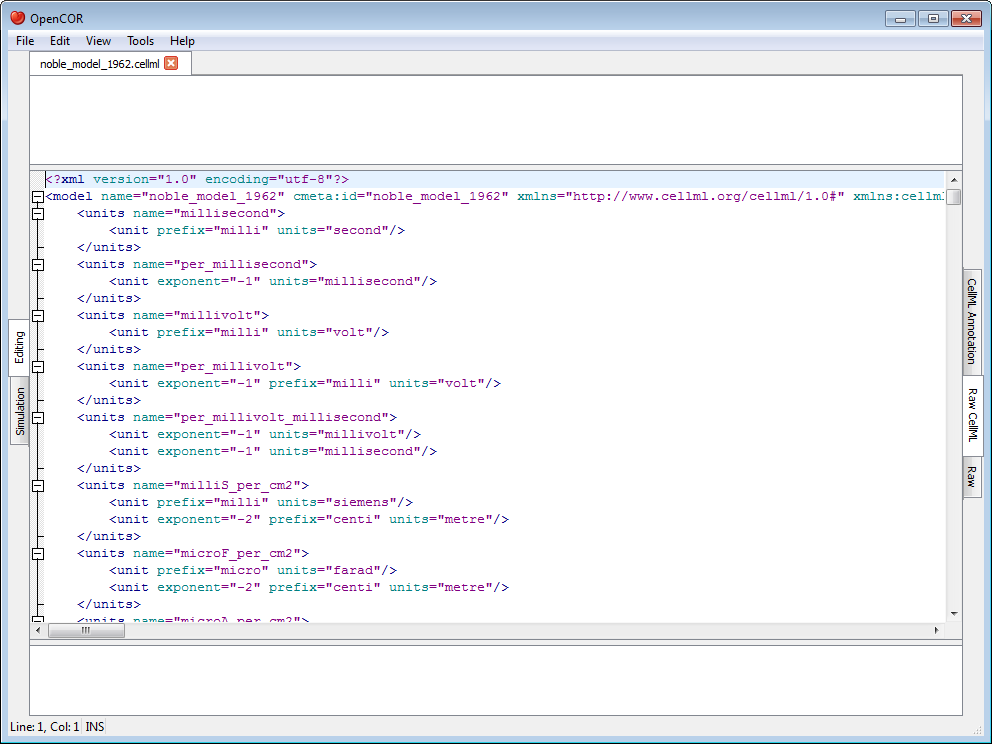
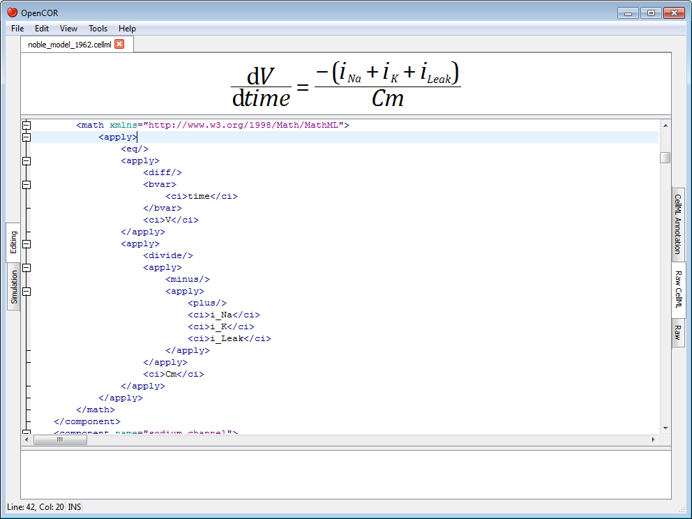
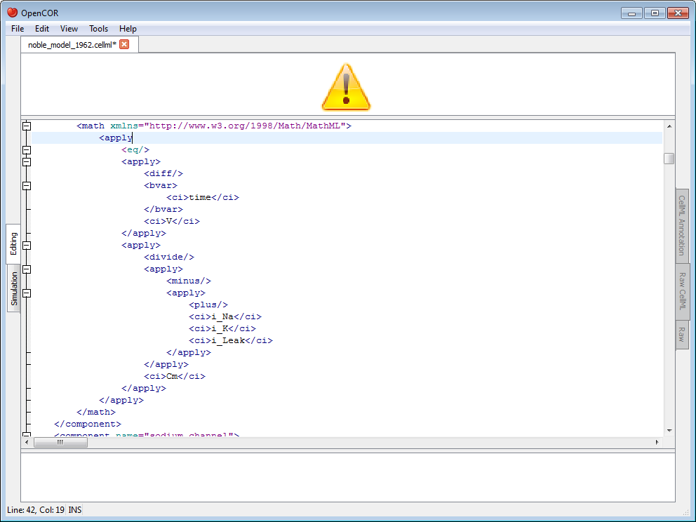
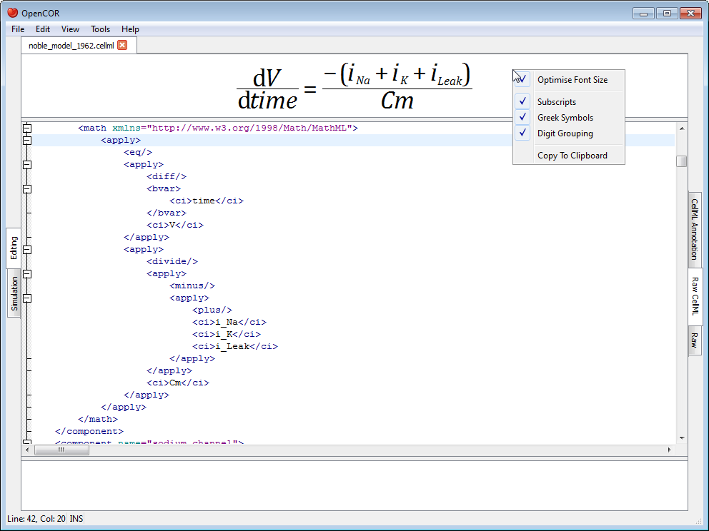
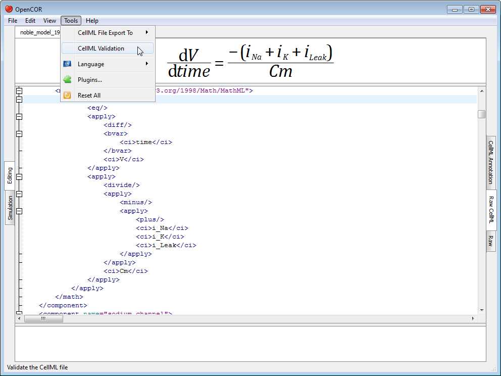
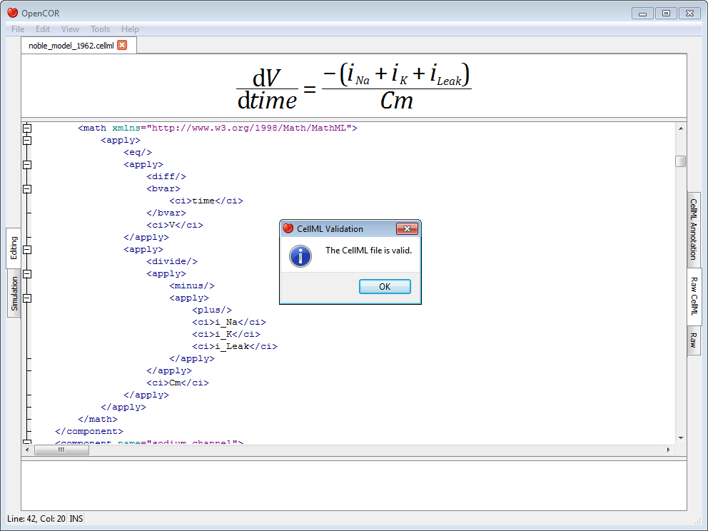
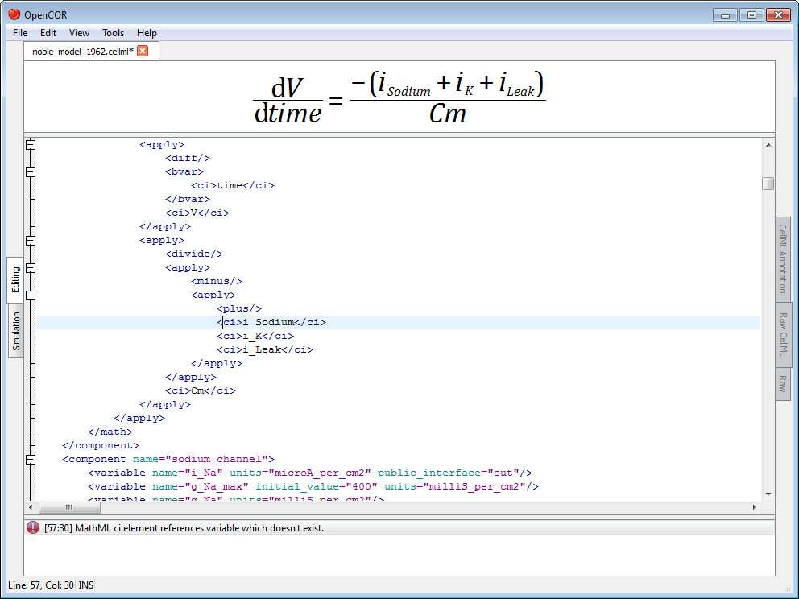

.. _OpenCOR-plugin-rawcellmlview:

====================
RawCellMLView Plugin
====================

The RawCellMLView plugin can be used to edit `CellML <http://cellml.org/>`_ files in their raw format using a text editor. If you open a file, it will look something like:

Besides using syntax highlighting, the text editor behaves in exactly the same way as the text editor in the :ref:`Raw <OpenCOR-plugin-rawview>` view.

The panel above the text editor is used to visualise mathematical equations in real-time. You just need the caret to be within a valid ``apply`` `MathML <http://www.w3.org/Math/>`_ block:

If the equation is not valid, a warning sign gets displayed:

The equation viewer can be customised using its context menu:

The font size can thus be optimised, so that an equation can take as much space as possible when rendered. Subscripts are also supported (e.g. ``a_b`` will be rendered as a\ :sub:`b`), as are Greek symbols (i.e. ``alpha``, ``beta``, etc. are replaced with α, β, etc.) and digit grouping (e.g. ``1000`` will be rendered as 1,000). A rendered equation can also be copied to the clipboard for use in another program.

The panel below the text editor is used to list any CellML issue that results from trying to validate a CellML file:

If the CellML file is valid, then a dialog box confirming its validity is displayed:

Otherwise, the bottom panel lists all the issues with the CellML file:

To double click on an issue will get the text editor to navigate to the corresponding line.