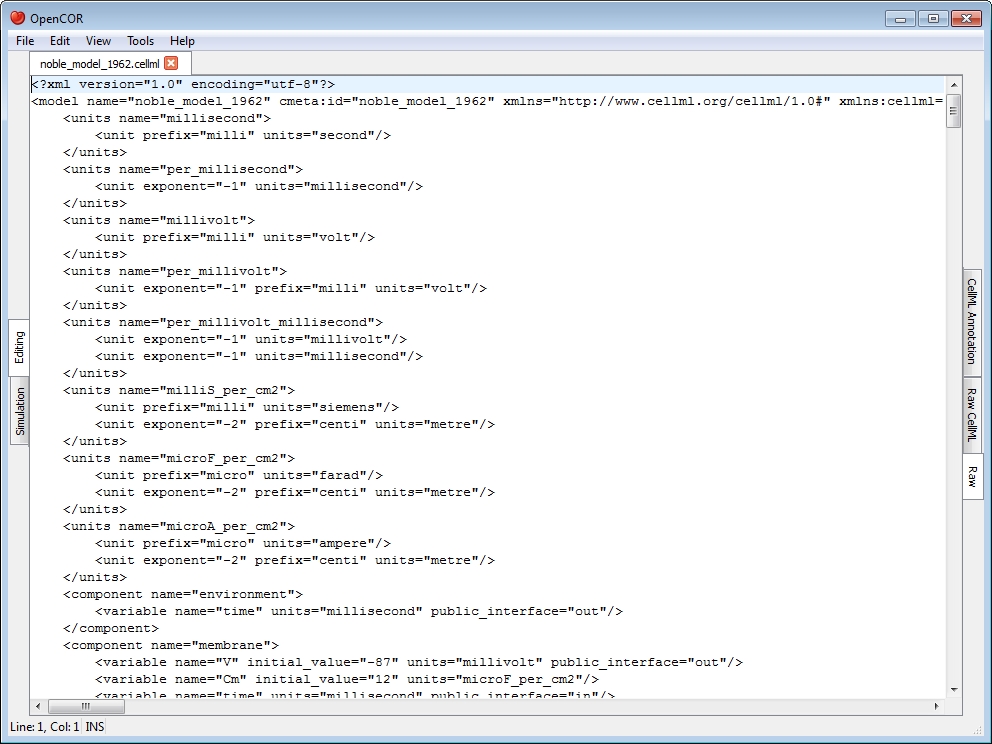
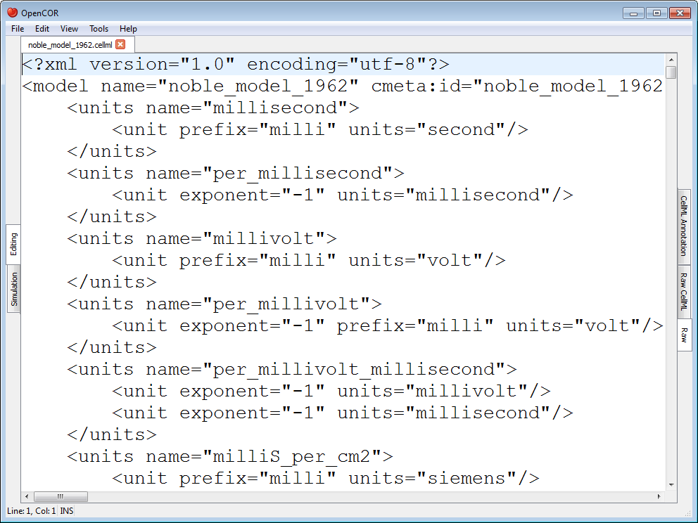
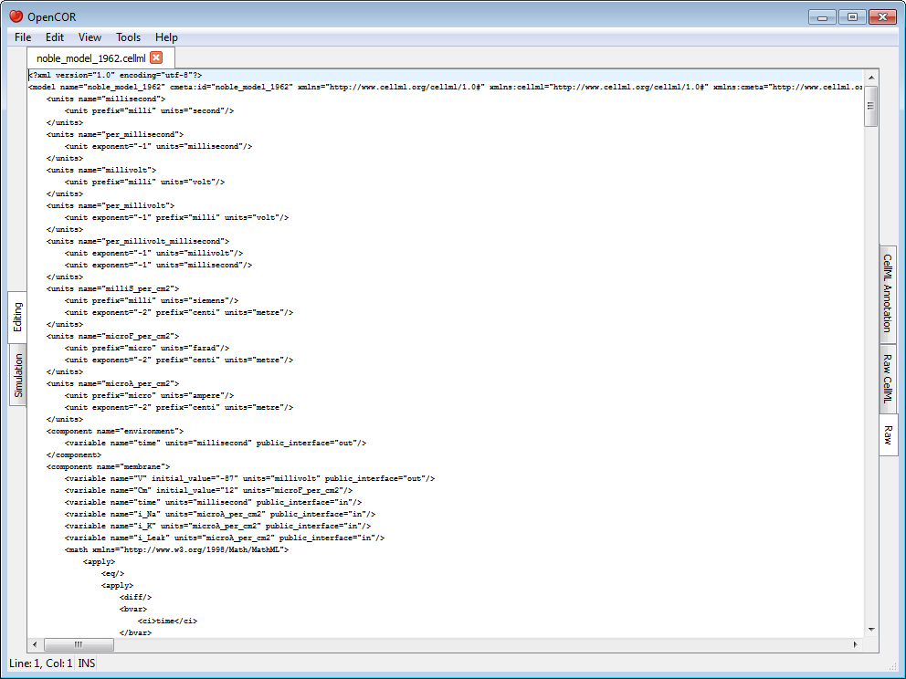
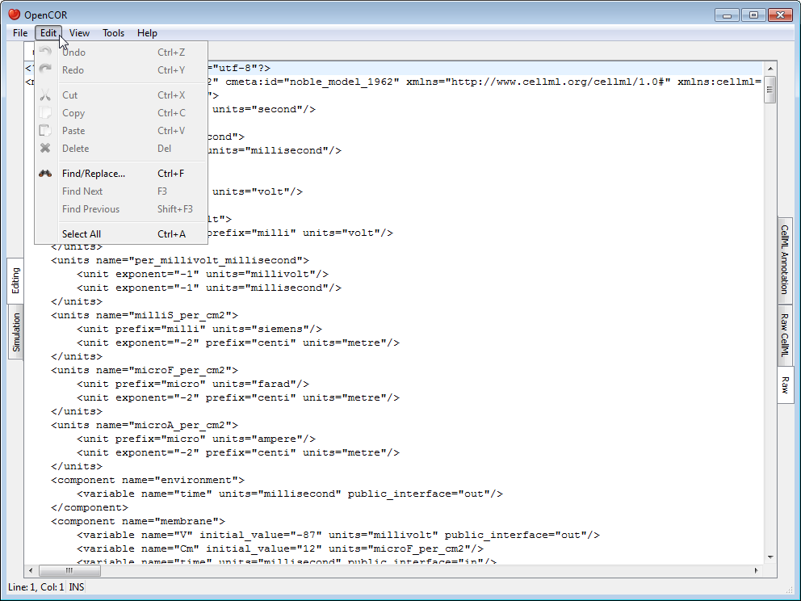
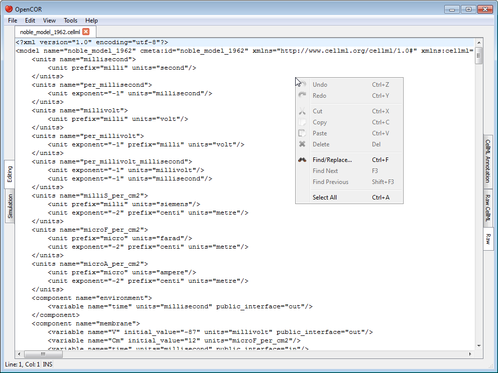
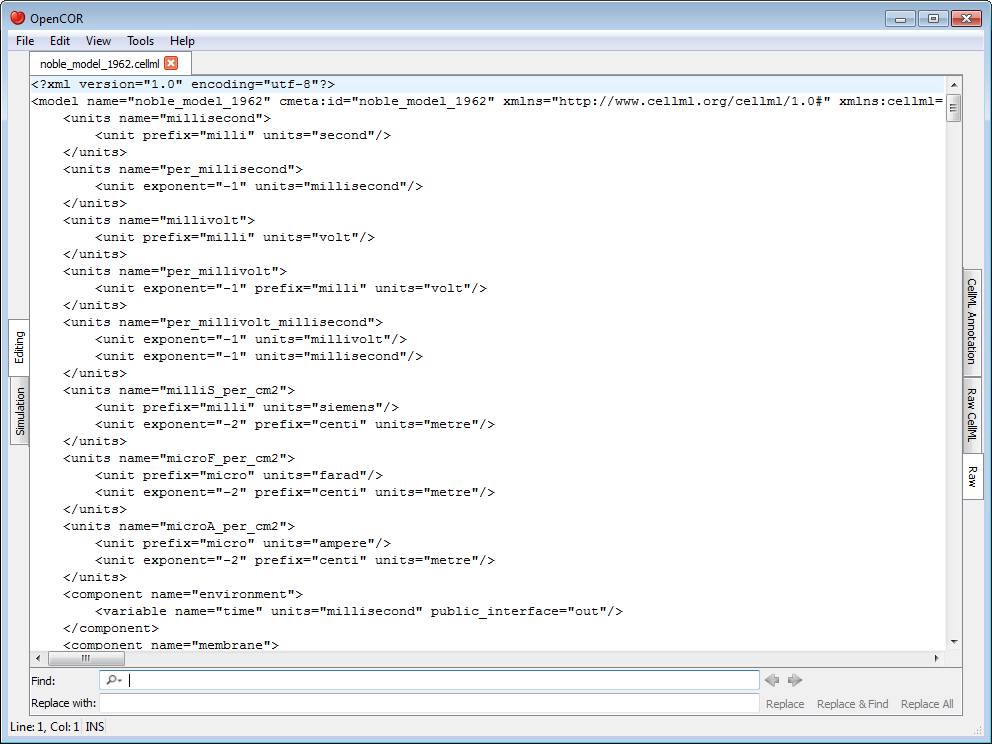
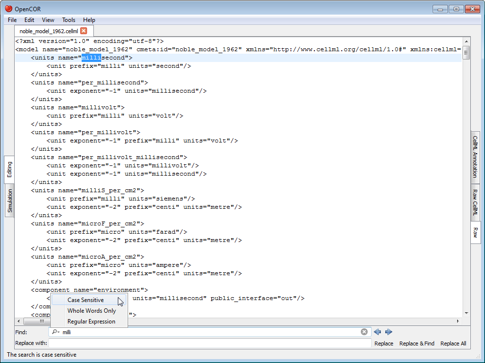

.. _OpenCOR-plugin-rawview:

==============
RawView Plugin
==============

The RawView plugin can be used to edit text-based files. If you open a file, it will look something like:

The bluish line at the top is used to highlight the line that contains the caret, which line and column numbers can be found at the bottom left of the screen, together with the current editing mode (``INS``: insert, ``OVR``: overwrite).

The size of the text can be increased and decreased by pressing :kbd:`Control-+` (or :kbd:`Control-=`) and :kbd:`Control--`, respectively. You can also change the size of the text by pressing :kbd:`Control` and moving the mouse wheel up or down. To reset the font size, press :kbd:`Control-0`.

To change the size of the text will do so for all the files that use this view and will be remembered from one session to another.

Traditional editing features can be accessed through the :guilabel:`Edit` menu, various keyboard shortcuts and the context menu of the editor:

The find/replace feature can be activated by, for example, pressing :kbd:`Control-F` (and hidden by pressing :kbd:`ESC`), as can be seen at the bottom of the screen:

As soon as you enter some text in the :guilabel:`Find` field, the view will jump to the first occurrence of that text. You can then search for the next or previous occurrence of that text by pressing :kbd:`F3` (or :kbd:`Control-G`, depending on your operating system) and :kbd:`Shift-F3` (or :kbd:`Control-Shift-G`), respectively. You can make the search case sensitive, look for whole words only and/or use a regular expression by selecting the requested option(s) from the drop-down menu to the left of the :guilabel:`Find` field:

To replace some text, you can use the :guilabel:`Replace with` field. From there, use one of the :guilabel:`Replace`, :guilabel:`Replace & Find` and :guilabel:`Replace All` buttons at the bottom right of the screen.