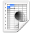

.. _OpenCOR-plugin-singlecellview:

=====================
SingleCellView plugin
=====================

The **SingleCellView** plugin can be used to run CellML models which consists of either a system of `ordinary differential equations <http://en.wikipedia.org/wiki/Ordinary_differential_equation>`_ (ODEs) or `differential algebraic equations <http://en.wikipedia.org/wiki/Differential_algebraic_equation>`_ (DAEs). The system may be `non-linear <https://en.wikipedia.org/wiki/Nonlinear_system>`_.

Open a CellML file
------------------

Upon opening a CellML file, OpenCOR will check that it can be used for simulation. If it cannot, then a message will describe the issue:

Alternatively, if the CellML file is valid, then the view will look as follows:

The view consists of two main parts, the first of which allows you to customise the simulation, the solver and the model parameters. The second part is used to plot simulation data. In the :guilabel:`Parameters` section, each model parameter has an icon associated with it to highlight its type:

.. |computedConstant|
    image:: ../resources/images/computedConstant.png
        :width: 16px
        :height: 16px

.. |rate|
    image:: ../resources/images/rate.png
        :width: 16px
        :height: 16px

================== ========================
|voi|              Variable of integration
|constant|         (Editable) constant
|computedConstant| Computed constant
|state|            (Editable) state
|rate|             Rate
|algebraic|        Algebraic
================== ========================

Simulate an ODE model
---------------------

To simulate a model, you need to provide some information about the simulation itself, i.e. its starting point, ending point and point interval. Then, you need to specify the solver that you want to use. The solvers available to you will depend on which solver :ref:`plugins <OpenCOR-pluginapproach>` you selected, as well as on the type of your model (i.e. ODE or DAE). In the present case, we are dealing with an ODE model and all the solver plugins are selected, so OpenCOR offers `CVODE <http://computation.llnl.gov/casc/sundials/description/description.html#descr_cvode>`_, forward `Euler <http://en.wikipedia.org/wiki/Euler_method>`_, `Heun <http://en.wikipedia.org/wiki/Heun's_method>`_, `Midpoint <http://en.wikipedia.org/wiki/Midpoint_method>`_, and second- and fourth-order `Runge-Kutta <http://en.wikipedia.org/wiki/Runge-Kutta_methods>`_ as possible solvers for our model.

Each solver comes with its own set of properties which you can customise. For example, if we select Euler (forward) as our solver, then we can customise its ``Step`` property:

At this stage, we can run our model by pressing the F9 key or by clicking on the |media-playback-start| button. Then, or before, you can add a graph. All the model parameters are listed to the bottom-left of the view, grouped by components in which they were originally defined. To add a graph, right click on a model parameter and select against which other model parameter you want it to be plotted. For example, to create a graph for ``V`` (from the ``membrane`` component) against the variable of integration (i.e. time since the simulation properties are expressed in milliseconds):

You can get the information associated with a graph by double clicking on it:

The :guilabel:`Model` property is used to associate the graph with a particular CellML file. By default, it has a value of :guilabel:`Current`, which means that if you select another CellML file, then OpenCOR will try to associate the graph with it (the |task-attention| icon will be shown next to the check box, if it cannot, as well as next to the X and/or Y properties to highlight which model parameter(s) could not be found in the other CellML file). The |object-unlocked| icon indicates that the graph is not locked, i.e. its Model property has a value of Current, while the |object-locked| icon is used when a graph is specifically associated with a CellML file (resulting in a red trace rather than a blue one). The X and Y properties can be modified either by editing their value or by right clicking on them and selecting another model parameter from the context menu, which can also be used to add or remove a graph.

Back to the simulation, you can see that it failed with several model parameters having a value of nan (i.e. not a number). This is because the solver was not properly set up: its Step property is too big. If you set it to 0.01 milliseconds, reset all the model parameters (by clicking on the |view-refresh| button) and clear the simulation data (by clicking on the |trash-empty| button), and restart the simulation, then you get the following trace:

.. image:: ../resources/images/plugins/SingleCellViewScreenshot07.png
    :align: center
    :width: 60%
    :alt: SingleCellView plugin: CVODE solver

The (roughly) same trace can also be obtained using the CVODE solver:

However, the simulation is so quick to run that we do not get a chance to see the progress of the simulation. Between the |trash-empty| and |list-add| buttons, there is a wheel which we can use to add a short delay between the output of two data points. Here, we set the delay to ``13 ms``. This allows us to rerun the simulation, after having reset the model parameters, and pause it at a point of interest:

Now, we can modify any of the model parameters identified by either the |state| or |constant| icon, but let us just modify ``g_Na_max`` (under the ``sodium_channel`` component) by setting its value to ``0 milliS_per_cm2``. Then, we resume the simulation and we can see the effect on the model:

If you want, you can export all the simulation data to a comma-separated values (CSV) file. To do so, you need to click on the |text-csv| button. Alternatively, if you want to create other graphs, but do not want them on the same graph panel as the existing one, you can click on the |list-add| button to create a new graph panel:

You might have noticed that the bottom graph panel has a blue vertical line to its left. This is to indicate that it is the currently selected graph panel (a graph panel can be selected by clicking on it). Something else you might have noticed is that the graphs area is now empty. This is because there are currently no graphs associated with the graph panel. Just for illustration, you can create a graph to plot V (from the membrane component) against V' (also from the membrane component):

You can create as many graph panels (and graphs) as you want. The current graph panel or all the graph panels (but the top one) can be removed by clicking on the |list-remove| button.

Simulate a DAE model
--------------------

To simulate a DAE model is similar to simulating an ODE model, except that OpenCOR only offers one DAE solver (`IDA <http://computation.llnl.gov/casc/sundials/description/description.html#descr_ida>`_) at this stage:

Simulate a CellML 1.1 model
---------------------------

So far, we have only simulated CellML 1.0 models, but we can also simulate CellML 1.1 models, i.e. models which import units and/or components from other models:

Simulate several models at the same time
----------------------------------------

Each simulation is run in its own thread which means that several simulations can be run at the same time. Simulations running in the 'background' display a small progress bar in the top tab bar while the 'foreground' simulation uses the main progress bar at the bottom of the view:

Plotting area
-------------

The plotting area offers several features that can be activated by:

* Zooming in/out:
   * Holding the right mouse button down, and moving the mouse to the bottom-right/top-left to zoom in/out; or
   * Moving the mouse wheel up/down; or
   * Using the context menu.
* Resetting the zoom level:
   * Double-clicking on the left mouse button; or
   * Using the context menu.
* Zooming into a region of interest:
   * Pressing Ctrl and holding the right mouse button down, and moving the mouse around.
* Panning:
   * Holding the left mouse button down, and moving the mouse around.
* Showing the coordinates of any point:
   * Pressing Shift and holding the left mouse button down, and moving the mouse around.
* Copying the contents of the plotting area to the clipboard:
   * Using the context menu.

Tool bar
--------

.. |media-playback-pause|
    image:: ../resources/images/oxygen/actions/media-playback-pause.png
        :width: 24px
        :height: 24px

.. |media-playback-stop|
    image:: ../resources/images/oxygen/actions/media-playback-stop.png
        :width: 24px
        :height: 24px

.. |view-refresh|
    image:: ../resources/images/oxygen/actions/view-refresh.png
        :width: 24px
        :height: 24px

.. |object-locked|
    image:: ../resources/images/oxygen/actions/object-locked.png
        :width: 24px
        :height: 24px

.. |list-add|
    image:: ../resources/images/oxygen/actions/list-add.png
        :width: 24px
        :height: 24px

.. |list-remove|
    image:: ../resources/images/oxygen/actions/list-remove.png
        :width: 24px
        :height: 24px

====================== ========================================================
|media-playback-start| Run the simulation
|media-playback-pause| Pause the simulation
|media-playback-stop|  Stop the simulation
|view-refresh|         Reset all the model parameters
|trash-empty|          Clear the simulation data
|list-add|             Add a graph panel
|list-remove|          Remove the current graph panel or all the graph panels
|text-csv|             Export the simulation data to CSV
====================== ========================================================
